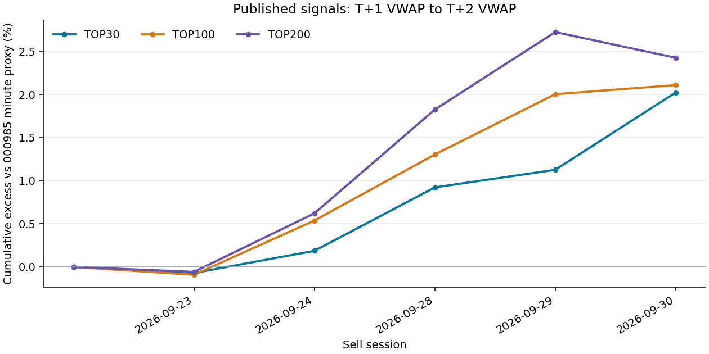
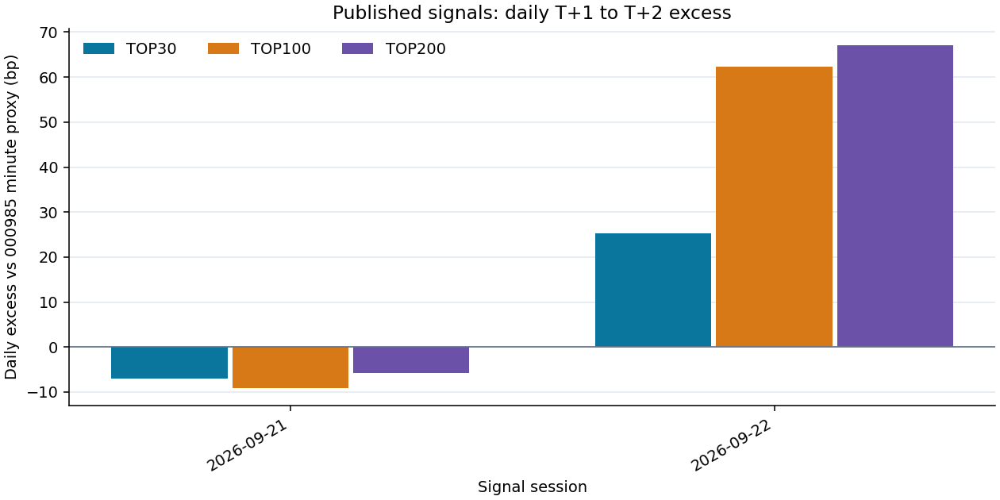

# 每日信号文件

`signals/YYYY-MM-DD.csv` 按信号日期归档；`latest.csv` 对应最近日期。
同名 JSON 文件记录日期、行数、编码、字段及 CSV 的 SHA-256。

CSV 编码为 UTF-8 BOM，按 `signal` 降序排列。

| 字段 | 格式说明 |
|---|---|
| rank_all | 全量排名，从 1 开始 |
| date | 信号日期，YYYY-MM-DD |
| code | 六位股票代码；读取时使用文本类型，保留前导零 |
| signal | 最终分数，数值越大排名越靠前 |
| close_limit_up | 当日收盘涨停标记，True / False |
| rank_ex_limit_up | 剔除收盘涨停后的排名；被剔除行为空 |

<!-- PUBLIC_PERFORMANCE_START -->
## 已发布信号的历史表现

仅统计本仓库 `signals/YYYY-MM-DD.csv` 已上传且买卖两日行情均完整的信号；截至 **2026-09-24**，共有 **2** 个已完成信号日，另有 **2** 个待结算或数据未齐。样本很短，暂无统计显著性结论。

| 组合 | 已完成信号日 | 组合累计收益 | 000985同期收益 | 累计超额 |
|---|---:|---:|---:|---:|
| TOP30 | 2 | -1.76% | -1.94% | +0.19% |
| TOP100 | 2 | -1.41% | -1.94% | +0.54% |
| TOP200 | 2 | -1.33% | -1.94% | +0.62% |

### 逐日超额（bp）

下表展示最近 10 个已结算信号日；1 bp = 0.01 个百分点。

| 信号日 | 卖出日 | TOP30 | TOP100 | TOP200 |
|---|---|---:|---:|---:|
| 2026-09-21 | 2026-09-23 | -7.01 | -9.14 | -5.73 |
| 2026-09-22 | 2026-09-24 | +25.36 | +62.25 | +67.07 |

[完整逐日超额序列](performance/daily_excess.csv) · [逐日收益与完整明细](performance/daily.csv) · [待结算日期](performance/pending.csv) · [000985 指数分钟均价代理](performance/index_000985_vwap_proxy.csv) · [统计摘要](performance/summary.json)

**口径：** 信号日按 `rank_ex_limit_up` 选 TOP30/100/200，等权；下一交易日以个股复权 VWAP 买入，再下一交易日以复权 VWAP 卖出。VWAP 为日成交额÷成交量；只在对应 TOP200 全部有有效买卖价时计入该信号日。000985.XSHG 使用相同买卖日期的**分钟指数点位按分钟成交额加权均价**作为 VWAP 代理；指数自身不可交易，指数汇总成交额÷成交量是成分股平均价格，不是指数点位。逐日超额为组合收益减指数收益；累计超额为组合复利净值÷指数复利净值−1。以上为假设 VWAP 均可成交的税费、冲击前表现；未处理涨跌停、停牌带来的实际成交约束。仓库没有使用本地模型回测或未上传的历史信号补齐。
<!-- PUBLIC_PERFORMANCE_END -->
